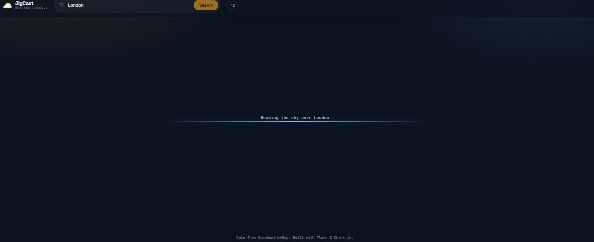
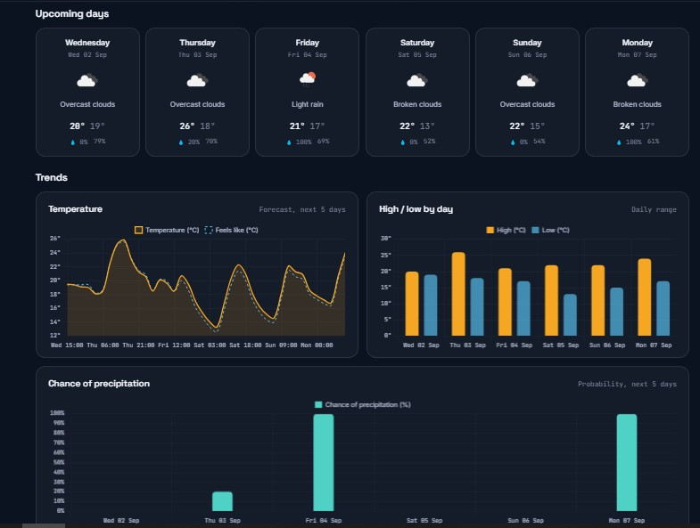
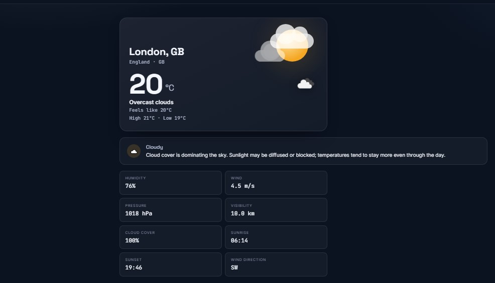

# 🌤️ JigCast — Weather Forecast Dashboard

**A polished, production-ready weather console built with Flask, vanilla JS, and Chart.js.**

Search any city or town for current conditions, a 5-day forecast, and live interactive charts — with a UI that subtly reshapes itself to match the sky outside.


## ✨ Features

- 🔎 **Location search** — city, town, or "city, country", resolved via OpenWeatherMap's geocoding API
- 🌡️ **Current conditions** — temperature, feels-like, min/max, humidity, wind speed & direction, pressure, visibility, cloud cover, sunrise/sunset
- 📅 **5-day forecast** — 3-hour data aggregated server-side into clean daily cards (high/low, precipitation chance, humidity, wind)
- 📖 **Condition explainer** — a plain-language explanation of whatever's happening outside right now
- 📊 **Interactive charts** — temperature trend, high/low comparison, and precipitation probability, all via Chart.js
- 🎨 **Weather-reactive theme** — background glow and an animated hero scene (sun, clouds, rain, snow, lightning, fog) shift with the forecast
- 📱 **Fully responsive** — mobile-first layout, no page reloads, graceful empty/loading/error states
- 🔒 **API key never leaves the server** — all OpenWeatherMap calls happen in Flask; the browser only talks to your own `/api/weather` endpoint


---

## 📸 Preview Screenshot 





## 🧱 Tech stack

| Layer        | Technology |
|--------------|------------|
| Backend      | Python 3, Flask, `requests`, `python-dotenv` |
| Frontend     | HTML5, CSS3 (custom properties), vanilla JavaScript |
| Charts       | [Chart.js 4](https://www.chartjs.org/) |
| Weather data | [OpenWeatherMap](https://openweathermap.org/) — Geocoding, Current Weather, 5 day/3 hour Forecast |
| Fonts        | Space Grotesk, Inter, JetBrains Mono |
| Deployment   | Gunicorn-ready — works on Render, PythonAnywhere, or any Python-friendly host |

## 🚀 Quick start

```bash
git clone https://github.com/your-username/aerovane.git
cd JigCast

python3 -m venv venv
source venv/bin/activate          # Windows: venv\Scripts\activate

pip install -r requirements.txt

cp .env.example .env              # then add your OpenWeatherMap key
python app.py
```

Open **http://localhost:5000** — you should be greeted by the empty state.

## 🔑 Getting an OpenWeatherMap API key

1. Sign up free at [home.openweathermap.org/users/sign_up](https://home.openweathermap.org/users/sign_up)
2. Grab your key from [home.openweathermap.org/api_keys](https://home.openweathermap.org/api_keys)
3. New keys can take a few minutes to a couple of hours to activate — if you see a "rejected our credentials" error right after signing up, wait a bit and retry
4. Everything this app uses (Current Weather, 5 day/3 hour Forecast, Geocoding) is included in the **free** OpenWeatherMap plan

## ⚙️ Environment variables

Copy `.env.example` to `.env` and fill in:

| Variable | Description | Default |
|---|---|---|
| `OPENWEATHER_API_KEY` | Your OpenWeatherMap API key | *(required)* |
| `WEATHER_UNITS` | `metric` (°C, m/s) or `imperial` (°F, mph) | `metric` |
| `FLASK_DEBUG` | Enable Flask's auto-reloading dev server | `false` |
| `PORT` | Port the app listens on | `5000` |
| `LOG_LEVEL` | Python logging level | `INFO` |

`.env` is already git-ignored — never commit your real key.

## 📡 API endpoints

| Method | Path | Description |
|---|---|---|
| `GET` | `/` | Renders the dashboard |
| `GET` | `/api/weather?city=<name>` | Current conditions + daily forecast + chart series as JSON |
| `GET` | `/healthz` | Health check for uptime monitors / PaaS probes |

<details>
<summary>Example success response</summary>

```json
{
  "ok": true,
  "data": {
    "location": { "name": "Lagos", "country": "NG", "state": null, "lat": 6.45, "lon": 3.39 },
    "current": { "temp": 29, "feels_like": 33, "condition": "Clouds", "...": "..." },
    "forecast": [{ "date": "2026-09-03", "day_name": "Thursday", "temp_max": 31, "temp_min": 26, "pop": 20, "...": "..." }],
    "series": [{ "dt": 1234567890, "label": "Thu 09:00", "temp": 28.4, "...": "..." }],
    "units": "metric"
  }
}
```

Errors follow `{ "ok": false, "error": "..." }` with an appropriate HTTP status (400/404/429/502/504) and a message that's always safe to show a user.
</details>

## 📁 Project structure

```
weather-app/
├── app.py                 # Flask app + routes
├── requirements.txt
├── .env.example
├── .gitignore
├── README.md
├── templates/
│   └── index.html
├── static/
│   ├── css/style.css      # design system, layout, animations
│   └── js/app.js          # fetch, rendering, charts, scene control
└── utils/
    └── weather.py         # OpenWeatherMap client, error types, forecast aggregation
```

## ☁️ Deployment

**Recommended: [Render](https://render.com)** — the most straightforward genuinely-free option for a Flask app like this (no credit card, no Dockerfile required). The tradeoff: the free web service tier spins down after ~15 minutes of inactivity, so the first request after a while takes 30–50 seconds to wake up.

## 🧠 Implementation notes

- **API key stays server-side** — every OpenWeatherMap call happens inside `utils/weather.py`; the browser only ever calls this app's own `/api/weather`
- **Daily forecast aggregation** — OpenWeatherMap's free tier only exposes 3-hour steps, so `utils/weather.py` groups them by date, taking min/max temperature, averaging humidity/wind, taking the max precipitation probability, and using the entry closest to noon for a representative icon
- **Errors are translated, never leaked** — every failure mode (bad key, unknown city, timeout, rate limit, malformed payload) becomes a specific error type with a safe, user-facing message and correct HTTP status — no raw tracebacks reach the client

## 👨‍💻 Author

Atunde Toheeb Ayomide (Jiggy)
📍 Lagos, Nigeria
📧 [atundetoheeb1@gmail.com](mailto:atundetoheeb1@gmail.com)
🔗 [GitHub](https://github.com/ceezign) | [LinkedIn](https://www.linkedin.com/in/atunde-toheeb-551826313)
💼 [Website](https://atunde-portfolio-web.vercel.app/)

## 📄 License

MIT — free to use, modify, and share.